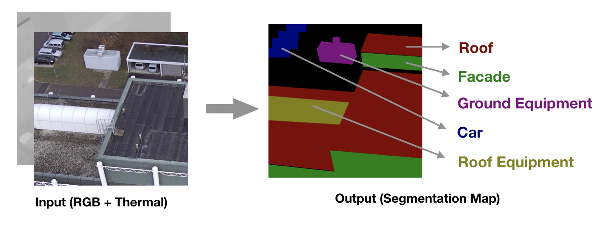
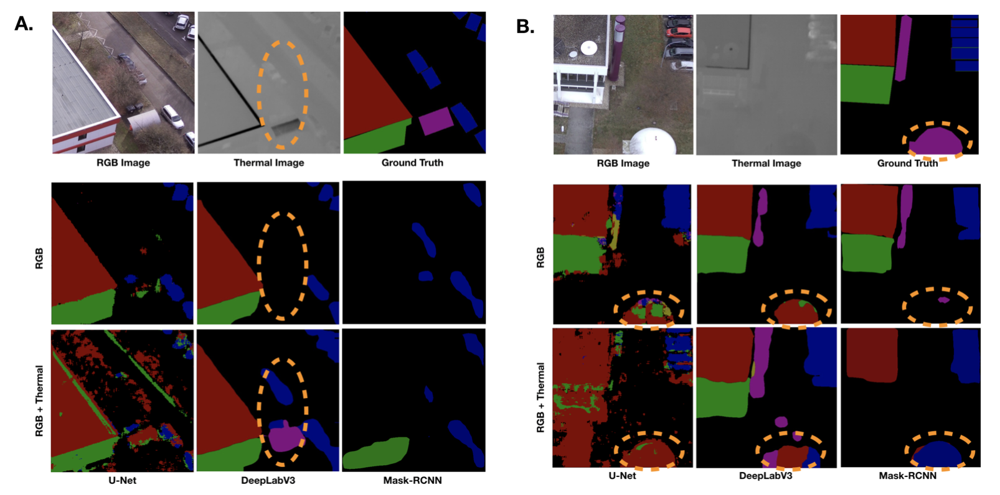

<link rel="stylesheet" href="css/rm.css">
# Semantic Segmentation of Outdoor Scenes utilizing Images Fusing RGB Channels with Thermal Channel

Traditional semantic segmentation task is fully based on visible light imaging input (RGB images), while the thermal information is also available for semantic segmentation in many applications. To utilize both the RGB data and thermal information, we have designed various novel deep convolutional neural networks (DCNNs) that fuzes the RGB information with thermal information for solving the semantic segmentation task.  These models allows the possibility of achieving better semantic segmentation performance when the thermal information is available in addition to RGB data. In our project, we experimented these (DCNNs) with our own dataset of landscape and buildings. In our observation, the fusion of thermal information can help the semantic segmentation task in specific cases, while the fusion of thermal information can also make the DCNNs hard to be trained and deteriorate the prediction.

## Problem Setting

In our semantic segmentation task, we need to classify each pixel in the images into one of the six predefined categories, including background, roof, facade, car, roof equipment, ground equipment, shown in Figure 1. In our problem, the input is a four-channel image, including RGB information and thermal information. The output is a segmentation map, a pixel-level prediction.

	

## Data

The images in our study is captured by a camera, FLIR Duo Pro R, mounted on a drone. This camera provides a thermal image (640 x 512) and a high-resolution optical image (4000 x 3000) for a single shot through an integrated package, in which the thermal images and RGB images are taken from the same altitude, the same angles, the same place and for the same objects. In order to have an obvious contrast in thermal images, the images were taken in a cold winter when energy loss was easy to detect. Our datasets has two major parts, including school campus view and city view. These two zones have different characteristics of landscape and buildings. The buildings in the campus are more sparse than in city zone. The ground truth are from mannually labeling by students. In total, We have 721 original labeled images (4000 x 3000), which are divided into training dataset (700 images), validation dataset (11 images) and test dataset (10 images). Since our image is in high resolution images and has a large field view, we cropped the images to generate images in smaller size (1500*1500). After processing, we have 6232 images as training dataset and 59 images (1500*1500) as validation dataset.

## Methods Overview

We constructed our models based on three previous representative works of segmentation task: U-Net, DeepLabV3 and MaskRCNN. We mainly tried two approaches to fuze the thermal information with the RGB information. In input fusion, we concatenate the thermal image with RGB image as the input of the network. In feature fusion, the thermal image and RGB image are abstracted into feature maps separately and the feature maps are concatenated at certain points. For the feature fusion, we also tried different variants of the structure. The details of experiments are included in sperate pages: [U-Net Experiment](unet.md), [DeepLabV3 Experiment](deeplabv3.md), [Mask-RCNN Experiment](maskrcnn.md).

## Results and Discussion

### Performance Evaluation
Here we present the IOUs for baseline models using RGB and our adapted models fusing RGB with thermal information.

<table>
    <thead>
        <tr>
            <th>Input</th>
            <th>Network</th>
            <th>Fusion</th>
            <th> mIOU </th>
            <th> Background </th>
            <th> Roof </th>
            <th> Facade </th>
            <th> Roof Equipment </th>
            <th> Car </th>
            <th> Ground Equipment </th>
        </tr>
    </thead>
    <tbody>
        <tr>
            <td> RGB </td>
            <td rowspan=3> U-Net </td>
            <td> N/A </td>
            <td> 0.442 </td>
            <td> 0.806 </td>
            <td> 0.771 </td>
            <td> 0.653 </td>
            <td> 0.018 </td>
            <td> 0.305 </td>
            <td> 0.096 </td>
        </tr>
        <tr>
        	<td rowspan=2> RGBT </td>
            <td> Input </td>
            <td> 0.231 </td>
            <td> 0.611 </td>
            <td> 0.460 </td>
            <td> 0.212 </td>
            <td> 0.000 </td>
            <td> 0.105 </td>
            <td> 0.000 </td>
        </tr>
        <tr>
        	<td> Feature </td>
            <td> 0.250 </td>
            <td> 0.610 </td>
            <td> 0.458 </td>
            <td> 0.326 </td>
            <td> 0.000 </td>
            <td> 0.102 </td>
            <td> 0.000 </td>
        </tr>
        <tr>
            <td> RGB </td>
            <td rowspan=3> DeepLabV3 </td>
            <td> N/A </td>
            <td> 0.455 </td>
            <td> 0.867 </td>
            <td> 0.854 </td>
            <td> 0.682 </td>
            <td> 0.028 </td>
            <td> 0.327 </td>
            <td> 0.135 </td>
        </tr>
        <tr>
        	<td rowspan=2> RGBT </td>
            <td> Input </td>
            <td> 0.513 </td>
            <td> 0.882 </td>
            <td> 0.876 </td>
            <td> 0.760 </td>
            <td> 0.030 </td>
            <td> 0.302 </td>
            <td> 0.311 </td>
        </tr>
        <tr>
        	<td bgcolor='red'> Feature </td>
            <td> 0.538 </td>
            <td> 0.907 </td>
            <td> 0.931 </td>
            <td> 0.815 </td>
            <td> 0.025 </td>
            <td> 0.338 </td>
            <td> 0.280 </td>
        </tr>
        <tr>
            <td> RGB </td>
            <td rowspan=3> Mask-RCNN </td>
            <td> N/A </td>
            <td> 0.484 </td>
            <td> 0.759 </td>
            <td> 0.703 </td>
            <td> 0.610 </td>
            <td> 0.000 </td>
            <td> 0.633 </td>
            <td> 0.200 </td>
        </tr>
        <tr>
        	<td rowspan=2> RGBT </td>
            <td> Input </td>
            <td> 0.472 </td>
            <td> 0.758 </td>
            <td> 0.696 </td>
            <td> 0.611 </td>
            <td> 0.000 </td>
            <td> 0.677 </td>
            <td> 0.089 </td>
        </tr>
        <tr>
        	<td> Feature </td>
            <td> 0.395 </td>
            <td> 0.680 </td>
            <td> 0.678 </td>
            <td> 0.534 </td>
            <td> 0.000 </td>
            <td> 0.407 </td>
            <td> 0.072 </td>
        </tr>
    </tbody>
</table>

### Test Prediction Sample

	

