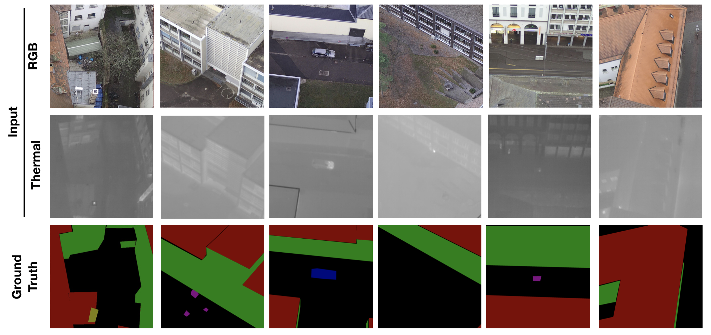
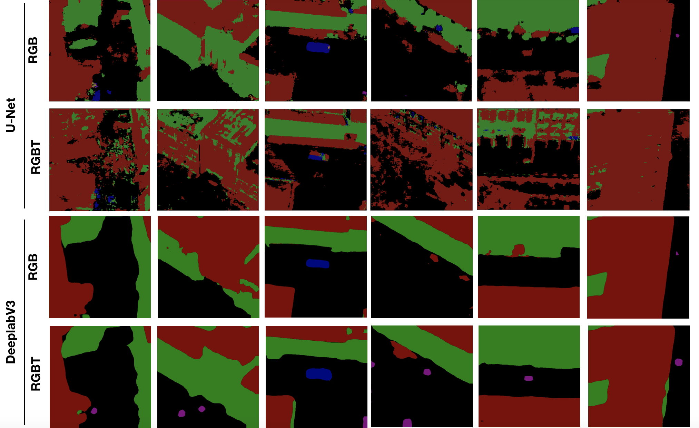
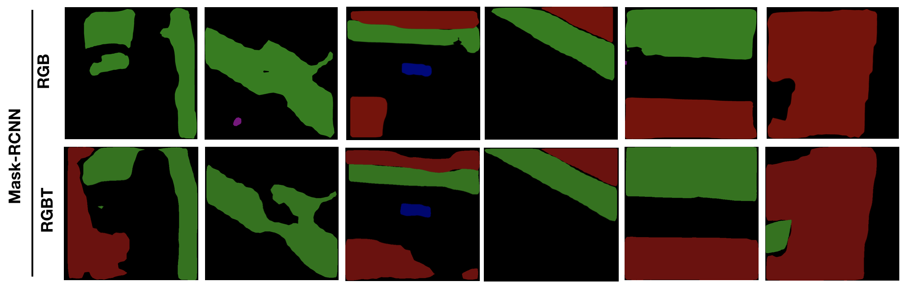

# Semantic Segmentation of Outdoor Scenes utilizing Images Fusing RGB Channels with Thermal Channel

Traditional semantic segmentation task is fully based on visible light imaging input (RGB images), while the thermal information is also available for semantic segmentation in many applications. To utilize both the RGB data and thermal information, we have designed various novel deep convolutional neural networks (DCNNs) that fuzes the RGB information with thermal information for solving the semantic segmentation task.  These models allows the possibility of achieving better semantic segmentation performance when the thermal information is available in addition to RGB data. In our project, we experimented these (DCNNs) with our own dataset of landscape and buildings. In our observation, the fusion of thermal information can help the semantic segmentation task in specific cases, while the fusion of thermal information can also make the DCNNs hard to be trained and deteriorate the prediction.

## Problem Setting

In our semantic segmentation task, we need to classify each pixel in the images into one of the six predefined categories, including background, roof, facade, car, roof equipment, ground equipment, shown in Figure 1. In our problem, the input is a four-channel image, including RGB information and thermal information. The output is a segmentation map, a pixel-level prediction.

	

## Data

The images in our study is captured by a camera, FLIR Duo Pro R, mounted on a drone. This camera provides a thermal image (640 x 512) and a high-resolution optical image (4000 x 3000) for a single shot through an integrated package, in which the thermal images and RGB images are taken from the same altitude, the same angles, the same place and for the same objects. In order to have an obvious contrast in thermal images, the images were taken in a cold winter when energy loss was easy to detect. Our datasets has two major parts, including school campus view and city view. These two zones have different characteristics of landscape and buildings. The buildings in the campus are more sparse than in city zone. The ground truth are from mannually labeling by students. In total, We have 721 original labeled images (4000 x 3000), which are divided into training dataset (700 images), validation dataset (11 images) and test dataset (10 images). Since our image is in high resolution images and has a large field view, we cropped the images to generate images in smaller size (1500*1500). After processing, we have 6232 images as training dataset and 59 images (1500*1500) as validation dataset.

## Methods Overview

We constructed our models based on three previous representative works of segmentation task: U-Net, DeepLabV3 and MaskRCNN. We mainly tried two approaches to fuze the thermal information with the RGB information. In input fusion, we concatenate the thermal image with RGB image as the input of the network. In feature fusion, the thermal image and RGB image are abstracted into feature maps separately and the feature maps are concatenated at certain points. For the feature fusion, we also tried different variants of the structure. The details of experiments are included in sperate pages: [U-Net Experiment](unet.md), [DeepLabV3 Experiment](deeplabv3.md), [Mask-RCNN Experiment](maskrcnn.md).

## Results and Discussion

### 1. Performance Evaluation
Here we present the IOUs for baseline models using RGB and our adapted models fusing RGB with thermal information. 

| Input | Network   | Fusion  |  mIOU  | Background |  Roof  | Facade |   Car  | Roof Equip.| Ground Equip. |
|-------|-----------|---------|--------|------------|--------|--------|--------|------------|---------------|
| RGB   | U-Net     |   N/A   | 0.442  | 0.806      | 0.771  | 0.653  | 0.305  | 0.018      | 0.096         |
| RGBT  | U-Net     |  Input  | 0.231  | 0.611      | 0.460  | 0.212  | 0.105  | 0.000      | 0.000         |
| RGBT  | U-Net     | Feature | 0.250  | 0.610      | 0.458  | 0.326  | 0.102  | 0.000      | 0.000         |
| RGB   | DeeplabV3 |   N/A   | 0.455  | 0.867      | 0.854  | 0.682  | 0.327  | 0.028      | 0.135         |
| RBGT  | DeeplabV3 |  Input  | 0.513  | 0.882      | 0.876  | 0.760  | 0.302  |**0.030**   |**0.311**      |
| RGBT  | DeeplabV3 | Feature |**0.538**| **0.907** |**0.931**|**0.815**| 0.338  | 0.025    | 0.280         |
| RGB   | Mask-RCNN |   N/A   | 0.484  | 0.759      | 0.703  | 0.610  | 0.633  | 0.000      | 0.200         |
| RBGT  | Mask-RCNN |  Input  | 0.472  | 0.758      | 0.696  | 0.611  |**0.677**| 0.000     | 0.089         |
| RGBT  | Mask-RCNN | Feature | 0.395  | 0.680      | 0.678  | 0.534  | 0.407  | 0.000      | 0.072         |

+ **Large scale objects are predicted well** : From the results, we can see that our model can segmented the background, building roof and building facade very well. However, performance in predicting small scale objects are much worse. Particularly, for the roof equipment, the highest IOU is only 0.03. Therefore, there are more works to do to enable a good predition for both large scale and small scale objects.

+ **DeeplabV3 shows the best Performance** :With the DeeplabV3 Network fuzing RGB with thermal we achived the highest mIOU 0.538 among all different methods we have tried. It also has the best performance in all classes except the car. For the car, the MaskRCNN network using RGB data alone has the best performance. Overall, the U-Net shows the worst performance in our task.

+ **Thermal information shows limited help** :With the fusion of thermal information, we achieves better performance in DeeplabV3 experiments. The model reaches significantly better performance in predicting background, roof and facade. However, the fusion of thermal information does not help in predicting small scale objects, including cars and equipments. It is also worth noting that the fusion of thermal information significantly deteriorate the performance in the experiments with U-Net and Mask-RCNN.

### 2. Prediction Sample
Here we present two representative prediction examples from our test dataset.

	

+ **Different Network Shows Different Prediction Pattern** : In the example A, we saw the U-Net tends to generate a fuzzy predition. The U-Net has a typical fully convolution structure and did not apply additional methods to preserve long-range information. We think this characteristic makes the prediction fuzzy in certain cases. In the deeplabV3, the model uses astrous convolution to enable a larger view of field and use the image pyramid pooling to combine the short-range and long-range information. Thus, the model generates a smooth prediction of building facades and building roof in example A. The Mask-RCNN shows a good prediction on the cars. However, the Mask-RCNN miss the prediction of building roof. In design principle of Mask-RCNN, it needs to find the region of interest first. We think the region of interest for the roof is not found, which makes the prediction wrong.

+ **Thermal Information Helps Identifying Hidden Objects** : In the observation of example A, we found the DeeplabV3 with thermal information successfully predict two cars behind the tree and a equpiment on the ground (Entities in dashed Circle). These objects are missed by the DeeplabV3 without thermal information. We found these objects are highly distinct in the thermal image, which might be the reason for the prediction.

+ **Equipment is Hard to Predict** : In the example B, we present a failure prediction case. All our methods fail to recognize the equipment on the ground in the images. The models are tend to predict this object to other classes, like roof or facade. In some cases, the prediction is a mixture of different classes. One potential reseason is that this equpiment has very similar feature to a building. In addition, this type of equipment has very few representation in our training datasets. Overall, the shape, color and look of the equipment can be very diverse, which needs lot of data to learn the features. However, this specific class has lowest representation in our dataset. 

More examples:

	
	
	

