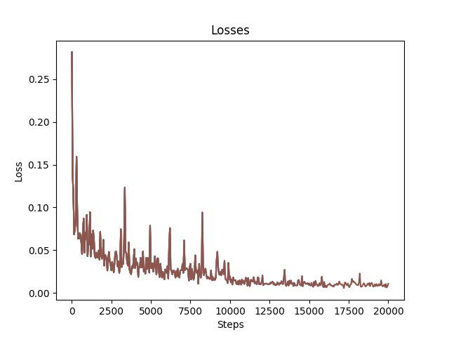
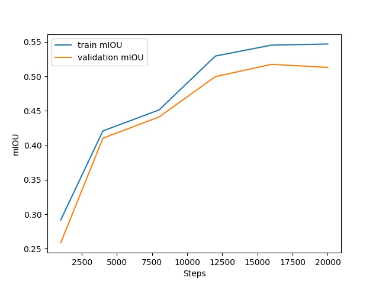

# DeepLabV3

## Experiment Setup

### RGB Baseline
We first trained a baseline DeepLabV3 model taking RGB images as input. We used ResNet-50 as network backbone and atrous_rates=6, 12, 18 for Atrous Spatial Pyramid Pooling(ASPP) layers. To achieve better results, we tried different sizes of input images and found 512x512 as the size with good performance and acceptable training speed. 

### Input Fusion
As mentioned, we tried two different fusion approaches of thermal information. For the first one, we concatenate RGB image and thermal image to get 4-channel input and put it into typical DeepLabV3 network. As we had more information from thermal channel, we attempted to add more filters in network backbone in order to learn more features. Also, due to the imbalance problem of our method, we applied weighted loss to force the network learn more about features of Class 3 and 5. We gave weights for the cross entropy losses of each pixel based on its label, the value of the weights for six classes are based on the ratio of the pixel numbers of each class.

### Feature Fusion
We also designed another fusion structure, which has separate backbones for RGB input and thermal input. The network concatenates feature maps out from two backbone networks and then put the result into ASPP layers. The network structure has been shown in previous section. As thermal images only has one channel, to reduce the number of parameters, we tried simpler backbone networks. Similar to Input Fusion, we applied weighted loss as well.

## Experiment Results
The following figures are curves of training loss and mIOU results of RGBT input fusion model without more filters or weighted loss. The IOU results on validation set of models with diffenrent settings are all shown in Table 1.

	

<em>Figure 1. Training loss for RGBT input fusion model without weighted loss.</em>

	

<em>Figure 2. Mean IOU results for RGBT input fusion model without weighted loss.</em>

| Input Data |     Fusion Method    | weighted loss |  mIOU  | BG |  Roof  | Facade | Roof Equip. |   Car  | Ground Equip. |
|:----------:|:--------------------:|:-------------:|:------:|:----------:|:------:|:------:|:-----------:|:------:|:-------------:|
|     RGB    |          N/A         |       N       | 0.4549 |   0.8674   | 0.8535 | 0.6819 |    0.0282   | 0.3268 |     0.1348    |
|    RGBT    |         Input        |       N       | 0.5130 |   0.8817   | 0.8761 | 0.7605 |    0.0302   | 0.3018 |     0.3113    |
|    RGBT    |         Input        |       Y       | 0.5195 |   0.8977   | 0.9058 | 0.7890 |    0.0319   | 0.3449 |     0.2573    |
|    RGBT    | Input + More Filters |       N       | 0.5227 |   0.9056   | 0.9179 | 0.8155 |    0.0359   | 0.3394 |     0.2348    |
|    RBGT    | Input + More Filters |       Y       | 0.5238 |   0.8996   | 0.9212 | 0.8129 |    0.0384   | 0.3369 |     0.2158    |
|    RGBT    |    Feature(ResNet)   |       N       | 0.5376 |   0.9065   | 0.9311 | 0.8149 |    0.0247   | 0.3378 |     0.2799    |
|    RGBT    |    Feature(3 Conv)   |       N       | 0.5276 |   0.9094   | 0.9253 | 0.8150 |    0.0014   | 0.3403 |     0.2787    |
|    RGBT    |    Feature(3 Conv)   |       Y       | 0.5225 |   0.9010   | 0.9166 | 0.8198 |    0.0354   | 0.3457 |     0.2093    |

From the table above, we can observe that thermal information can help improve the performance with DeepLabV3 network structure, especially for category Facade and Ground Equipment, which may have significant energy differences with their neighbor objects. For the two thermal fusion approaches, the seperate ResNet bockbone for thermal channel has the best overall performance, but the improvement is not very significant. Considering the large number of more parameters it uses, we may consider to use simple input fusion for a smaller model size and faster training speed in practical uses. Or we need to explore some more advanced fusion approaches to learn features from thermal channel better.

However, we can still see the relatively low IOU for Class Roof Equipment, and Ground Equipment as well. The attempts of using weighted loss does not help a lot. To figure this out, we need to collect more data on these imbalance categories and try some more advanced techniques to deal with the imbalance of classes.