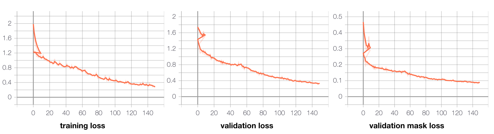
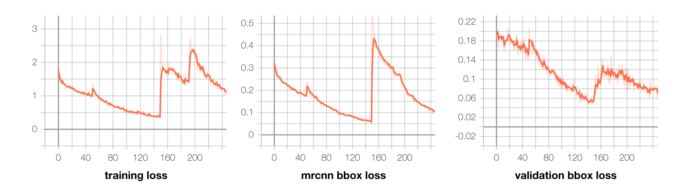
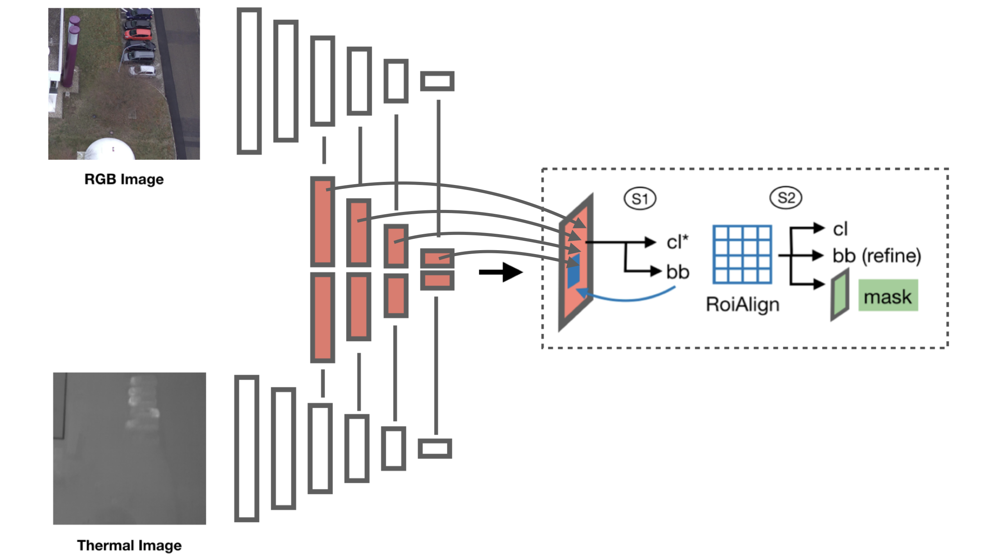
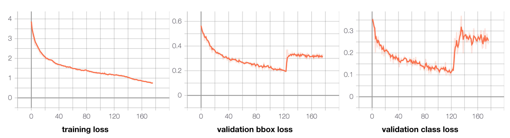

# MaskRCNN

## Overview

In this task, we used a classic semantic segmentation framework, Mask RCNN. Different from the previous approaches in this project, Mask RCNN needs to detect some regions of interests, and then classify the detected regions. This approaches can be used to conduct instance segmentation. Instance segmentation can treat multiple objects of the same class as separated individuals, but the previous approaches, like U-net and DeepLabV3, treat multiple objects of the same class as a whole entity. We planned to use this approach because this approach can solve the problem in an alternative way. We planned to explore how different the algorithm work. 

Similar to the U-net and DeepLabV3, we did different experiments on Mask RCNN. First, we used Mask RCNN directly on the RGB images. Second, we brutally concatenated the thermal channel onto the end of the RGB channels. This method is input fusion. Third, we changed the network of the algorithm. This method is feature fusion.

## Experiment Details

Based on the above introduction, we first attempted to add one more thermal channel input, and then fused the feature maps of RGB and thermal inputs. Hence, we set up experiments based on the three main different methods.

### Input Fusion

For the RGB images as input, it is just a simple semantic segmentation task. To do that, we first simply used Mask RCNN with the default parameters. Then, it is intuitive to optimize for better parameters. After a set of experiments, we finalized the parameters as:

| parameters 					| value	| 
|-------------------------------|-------|
| IMAGES_PER_GPU				| 1		|
| STEPS_PER_EPOCH				| 800	|
| DETECTION_MIN_CONFIDENCE		| 0.7	|
| MEAN_PIXEL					| [123.7, 116.8, 103.9]|
| MAX_GT_INSTANCES				| 20	|
| RPN_TRAIN_ANCHORS_PER_IMAGE	| 128	|
| RPN_ANCHOR_SCALES				| (32, 64, 128, 256, 512)|
| Mini_Mask						| (512, 512)|
| Image_size					| (512, 512) |
| DETECTION_MIN_CONFIDENCE		| 0.9|

After all the parameters were set, we tested the IoUs for 5+1 classes again, and obtained the result:

| Input Data | Tuning | mIOU   | Background | Roof   | Facade | Roof Equip. | Car    | Ground Equip. |
|------------|--------|--------|------------|--------|--------|-------------|--------|---------------|
| RGB        | N      | 0.3176 | 0.5363     | 0.4550 | 0.4124 | 0           | 0.4452 | 0.0564        |
| RGBT       | Y      | 0.4421 | 0.7243     | 0.6105 | 0.6115 | 0           | 0.4889 | 0.2174        |

### Feature Map Fusion

After we got the best performance possible for RGB input, we attempted to add one more input channel. 

With the previous RGB parameters, we got a worse performance. After we looked into from which part the Mask RCNN loss come, we found the ```RPN_BBOX_LOSS``` and ```MRCNN_BBOX_LOSS``` were relatively high to others, and they were still slowly converging to a lower value. To speed up the training, we set a different weight to different loss parts. 

#### Stage 1:

```Python
RPN_BBOX_LOSS = 1 -> 4
MRCNN_BBOX_LOSS = 1 -> 3.2
MRCNN_MASK_LOSS = 1 -> 2
```

#### Stage 2:
After stage 1, the losses all converged and started to lower very slowly, we then increased the loss again. 

```Python
RPN_BBOX_LOSS = 4 -> 6
MRCNN_BBOX_LOSS = 3.2 -> 4
MRCNN_MASK_LOSS = 2 -> 3
```

After the two stages, we found that the loss was not going to change whatever we set the loss weight. Then we also detected the model on the test dataset, and got the IoU shown below.

| Input Data | Stage | mIOU    | Background | Roof    | Facade  | Roof Equip\. | Car     | Ground Equip\. |
|------------|-------|---------|------------|---------|---------|--------------|---------|----------------|
| RGBT       | 1     | 0\.4458 | 0\.7146    | 0\.5813 | 0\.5953 | 0            | 0\.6542 | 0\.1294        |
| RGBT       | 2     | 0\.4710 | 0\.7708    | 0\.7628 | 0\.6110 | 0            | 0\.6080 | 0\.0736        |


### Feature Fusion

After we tried our best on the thermal channel input fusion, we came up with the idea on how to better extract the thermal information and at the same time give less confusion on the RGB features. The way we tried on Mask RCNN was to fuse the RGB feature maps with the thermal feature maps. In this way, we expected the network could handle the feature maps as what was needed for detection and region proposal. 

However, when we tried to add one parallel backbone ResNet 101, we find the hardware can not handle this large network, even the largest GPU we can have on GCP with 16 GB memory. We have attempted to use various ways to increase the hardware capacity, for instance to increase the number of GPUs, to add more RAM for the PC, and to use better GPU. None of them worked. 

Then we put our eye on reducing the network size. In other words, we had to trade off some network capacity for better thermal information extraction. To reduce the network, we reset the parameters as below:

```Python
BACKBONE_NETWORK = 'ResNet50' -> 'ResNet 101'
MASK_SIZE = (512, 512) -> (128, 128)
ROI_PROPOSAL_INTANCE = 512 -> 128
```

After all parameters tuning, the best performance we can get is:

| Input Data | mIOU    | Background | Roof    | Facade  | Roof Equip\. | Car     | Ground Equip\. |
|------------|---------|------------|---------|---------|--------------|---------|----------------|
| RGBT       | 0\.3951 | 0\.6795    | 0\.6781 | 0\.5343 | 0            | 0\.4065 | 0\.0724        |


## Discussion and Conclusion 

### RGB Input

For this method, we have tried our best to improve the performance by just tuning hyperparameters. When the network loss is not going to change greatly, we get a relatively good result. The loss plot is shown:

<p align="center">
	
</p>
<p align = "center">
<em>Figure 1. RGB input loss</em>
</p>

### Input Fusion

For the input fusion method, we inherit the parameter from RGB input model. In addition, we also used various training tricks including the weighted loss on different part of the network. Since Mask RCNN is a huge network, training from end to end is slow to converge. However, our dataset is very different to the normal ones (e.g. COCO and ImageNet). We have to train our own parameters from scratch. With our effort, the result also seems reasonable and great.

However, we can still see some big facade and roof are totally missing in the network. This is because we still need to make more efforts to include large features in the network. We will try padding and other augmenting methods to further improve the network in the future.

<p align="center">
	
</p>
<p align = "center">
<em>Figure 2. RGB-Thermal input fusion loss</em>
</p>

### Feature Fusion

<p align="center">
	
</p>
<p align = "center">
<em>Figure 3. Mask RCNN shortcut network model</em>
</p>

In this method, we had to trade off some network capacities. However, the result showed the ResNet 50 was not good enough for this tasks. The result we obtained was worse even than RGB result. After viewing the thermal images, we found sometimes the thermal data was quite confusing for network. It was like we added a noise channel to the network, which helps to detect from time to time. Hence, we will try to add a simple shortcut to the network with a similiar idea of ResNet. With this approach, thermal noise will be more helpful and easier to train.


<p align="center">
	
</p>
<p align = "center">
<em>Figure 4. RGB-Thermal feature fusion loss</em>
</p>


