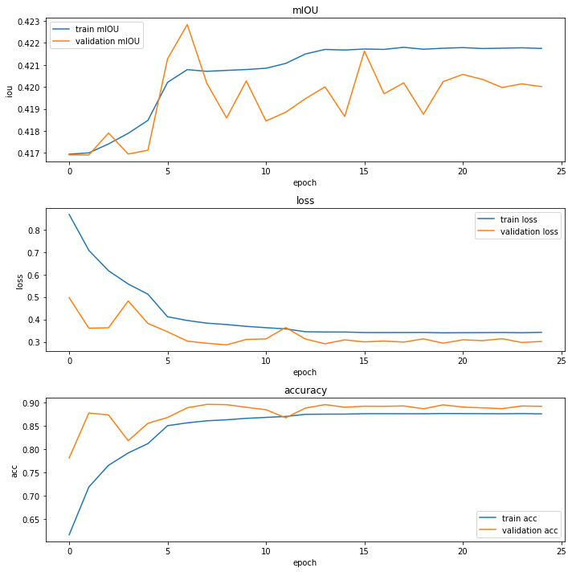
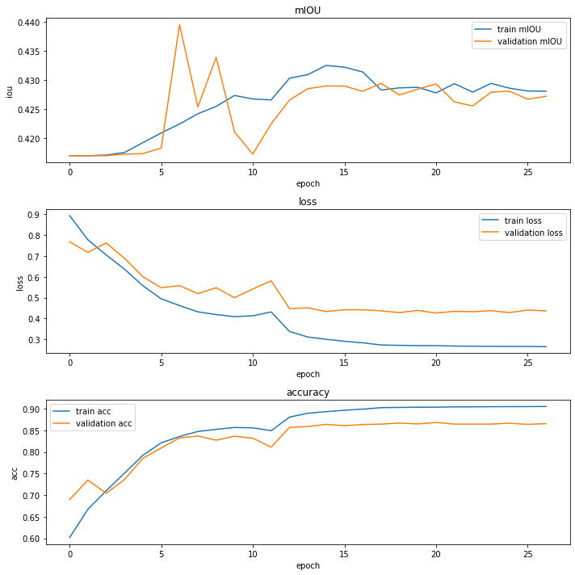
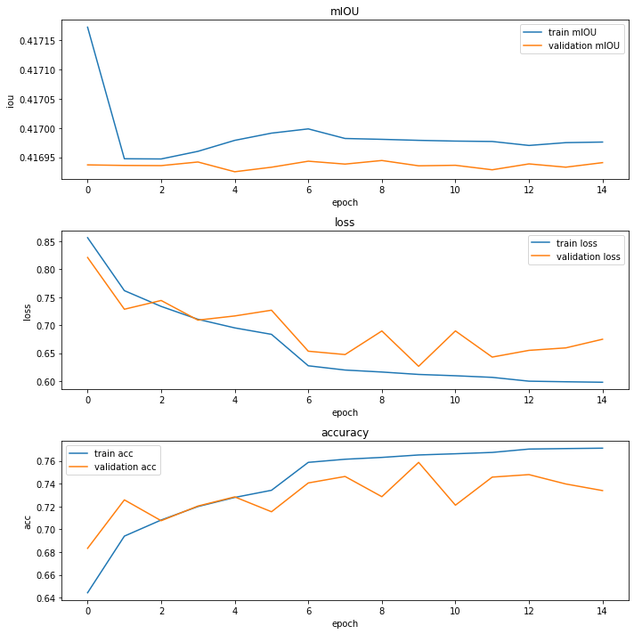
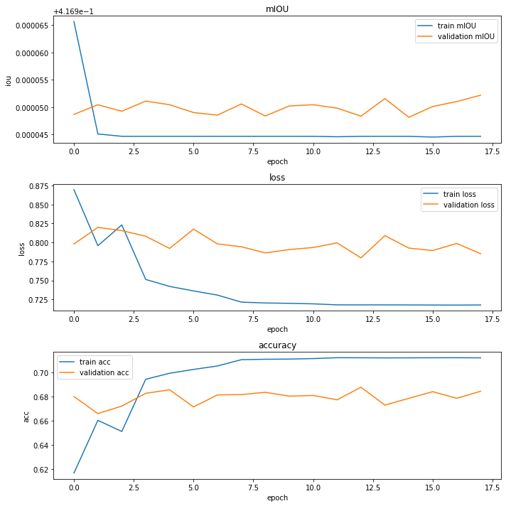
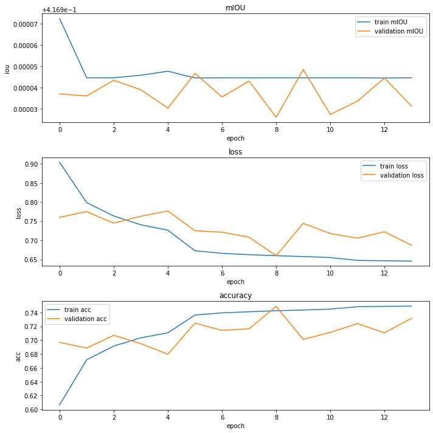

# Experiment Setup
## RGB Baseline
A vanilla baseline U-net model are applied to take RGB images as input. We used vgg16 as network backbone and 3x3 convolution with 2x2 strides as encoder layers. 

## Input Fusion
Two different fusion approaches are applied to combine thermal information. As for input fusion, we concatenate RGB image and thermal image to get 4-channel input and put it into vanilla U-net. Since we had more information from thermal channel, we add more filters in network backbone in order to learn more features.

## Feature Fusion
As for feature fusion, we add an alternative path with separate backbone for thermal input. The network fuses feature maps from two backbone routes together and then put the concatenated feature maps into decoder layers. To simplify the problem, we use the same backbone (vgg16) for both routes.

## Parameter Setting

For all the experiments, we set 512-256-128-64-32 upsampling channels as decoder, followed by 3x3 convolutional filters with 2x2 strides. Early stopping is adopted to prevent overfitting. We use Adam optimizer with learning rate 1e-3 and reduce learning rate on plateau. Cross Entropy loss is adopted.

# Ablation Results

We train U-net on 256x256 and 512x512 rgb and rgbt images with or without pretrained backbone models. Disappointingly, rgbt images of 512x512 size cannot capture useful information and can only output blank image predictions, mainly due to fine-tune errors or we need to elegantly design the model structure. As shown in Table 1, we see that in rgb images, larger size can capture more features and thus yield better results (0.400 mIOU compared with 0.442 mIOU). Transfer learning with pretrained weights cannot yield better result in this specific case (0.304 mIOU compared with 0.400 mIOU) probably because that imagenet features are too far away from that of city spaces. Superisingly, adding thermal channels worses the situation a lot and get a much lower mIOU overall (0.231, 0.250), which can probably be improved by better design in the future.

*Emphasized* Table 1. Experiment Results

| Channel |  Fusion | Size | Pretrain |  mIOU | Background |  Roof | Faced | Roof Equipment |  Car  | Ground Equipment |
|:-------:|:-------:|:----:|:--------:|:-----:|:----------:|:-----:|:-----:|:--------------:|:-----:|:----------------:|
|   RGB   |   N/A   |  512 |     N    | 0.442 |    0.806   | 0.771 | 0.653 |      0.018     | 0.305 |       0.096      |
|   RGB   |   N/A   |  256 |     N    | 0.400 |    0.746   | 0.663 | 0.625 |      0.002     | 0.287 |       0.059      |
|   RGB   |   N/A   |  256 |     Y    | 0.304 |    0.667   | 0.505 | 0.477 |        0       | 0.156 |       0.019      |
|   RGBT  |  Input  |  256 |     N    | 0.231 |    0.611   | 0.460 | 0.212 |        0       | 0.105 |         0        |
|   RGBT  | Feature |  256 |     N    | 0.250 |    0.610   | 0.458 | 0.326 |        0       | 0.102 |         0        |

The training procedure is shown as follows. We see that when thermal channel is added (Fig. 4, Fig. 5), the validation loss curve tends to be relatively constant or fluctuate in a certain range. And both training mIOU of rgbt drops in epoch 2 sharply and cannot go up.

	

*Emphasized* Figure 1. 256x256 rgb Images without pretrain

	

*Emphasized* Figure 2. 512x512 rgb Images without pretrain

	

*Emphasized* Figure 3. 256x256 rgb Images with pretrain

	

*Emphasized* Figure 4. 256x256 rgbt Images without pretrain

	

*Emphasized* Figure 5. 256x256 rgbt Images without pretrain

